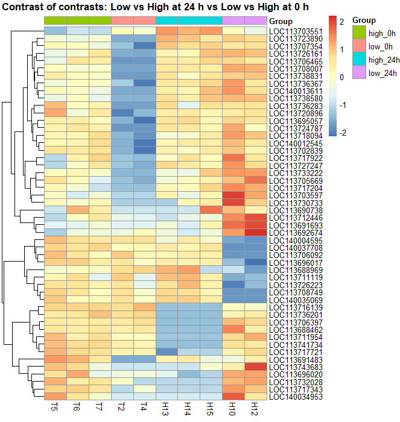
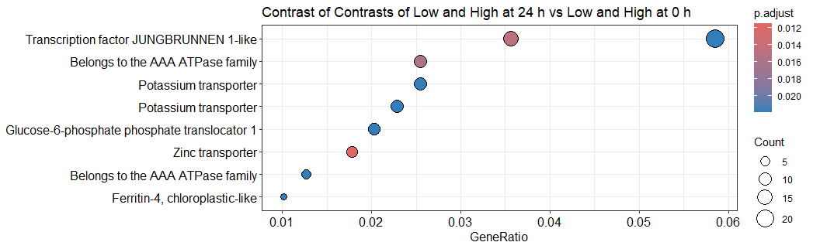
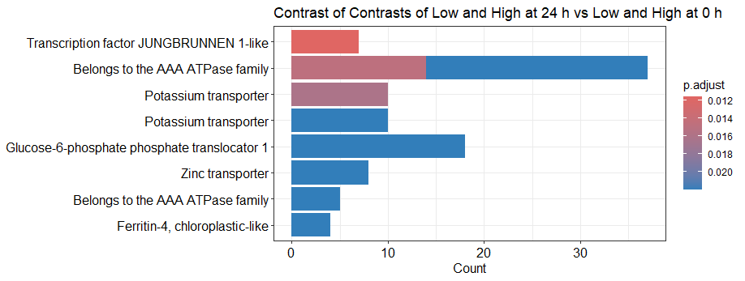
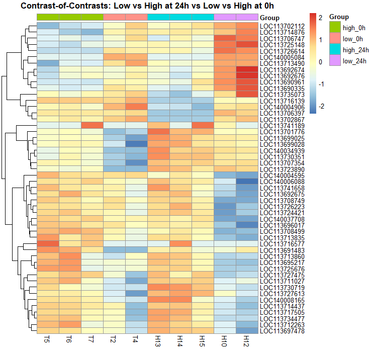

# Transcriptomics_Coffee-Rust_contrasts
This script was developed to perform a contrast-of-contrasts analysis using edgeR to evaluate transcriptional dynamics in coffee plants infected with rust (*Hemileia vastatrix*) with different levels of severity. Specifically, it compares the gene expression differences between high vs. low severity at 24 hours against those observed at 0 hours, to identify genes whose regulation is time-dependent and response-specific.

# Part I: 
## Contrast of contrasts between high vs. low severity at 24 hours vs 0 hours. 

**Function**  
contrast_of_contrasts_1 = (low_24h - high_24h) - (low_0h - high_24 h)

**The workflow includes the following key steps:**
1. Preprocessing of raw counts: loading the count matrix, assigning groups, and filtering lowly expressed genes.
2. Normalization and dispersion estimation: adjusting library sizes and estimating dispersion parameters to ensure robust statistical modeling.
3. Contrast-of-contrasts testing: applying a generalized linear model (GLM) to compare expression differences across timepoints and treatments.
4. Differentially expressed genes (DEGs): extracting significant genes based on FDR thresholds and fold-change cutoffs.
5. Visualization with a heatmap: representing the standardized expression (z-scores) of the most significant genes, ordered by experimental groups for biological interpretation.

This approach aims to identifiy genes that are not only differentially expressed between treatments, but also dynamically regulated over time, to highlight molecular pathways potentially involved in stress responses and adaptation in *Coffea arabica*.

## _Heatmap of differentially expressed genes using edgeR_

## Step 0: Initial configuration. 
```r
setwd("D:/lucianoboa/royatranscriptomics/analysis/practice")  # adjust path
library(edgeR)
library(pheatmap)
```

## Step 1. Load raw count matrix. 
```r
countData <- read.table("counts_matrix_transcript_id.txt", 
                        header = TRUE, row.names = 1, sep = "\t")
countData <- countData[, 6:21]  # select columns of interest

# Rename columns according to experimental design
colnames(countData) <- c("H10","H11","H12","H13","H14","H15","H16","H9",
                         "T1","T2","T3","T4","T5","T6","T7","T8")
```

## Step 2: Define experimental groups
```r
group <- rep(NA, ncol(countData))
names(group) <- colnames(countData)
group[c("H13","H14","H15")] <- "high_24h"
group[c("H10","H12")] <- "low_24h" 
group[c("T2","T4")] <- "low_0h" 
group[c("T5","T6","T7")] <- "high_0h"

# Keep only columns with defined groups
countData <- countData[, !is.na(group)]
group <- group[!is.na(group)]
group <- factor(group)
```

## Step 3: Create DGEList and normalization
```r
dge <- DGEList(counts = countData)
dge <- calcNormFactors(dge)
```

## Step 4: Filter lowly expressed genes
```r
keep <- rowSums(cpm(dge) > 1) >= 2  # CPM > 1 in at least 2 samples
dge <- dge[keep, , keep.lib.sizes=FALSE]
```

## Step 5: Design matrix and dispersion estimation
```r
design <- model.matrix(~0 + group)
colnames(design) <- levels(group)

dge <- estimateDisp(dge, design)
fit <- glmFit(dge, design)
```

## Step 6: Contrast of contrasts
```r
# (high_24h - low_24h) - (high_0h - low_0h)
lvl <- colnames(design)
contrast_vector <- numeric(length(lvl))
contrast_vector[which(lvl == "low_24h")]   <- 1
contrast_vector[which(lvl == "low_0h")]    <- -1
contrast_vector[which(lvl == "high_24h")]  <- -1
contrast_vector[which(lvl == "high_0h")]   <- 1

lrt <- glmLRT(fit, contrast = contrast_vector)
```

## Step 7: Extract DEG table
```r
deTab <- topTags(lrt, n = Inf)$table

# Filter DEGs (adjust thresholds if very few genes pass)
deGenes <- rownames(deTab)[deTab$FDR < 0.2 & abs(deTab$logFC) > 0.5]
if(length(deGenes) < 2){
  topN <- min(10, nrow(deTab))
  deGenes <- rownames(deTab)[order(deTab$FDR)][1:topN]
}
```

## Step 8: Normalized CPM and z-score transformation
```r
cpm_norm <- cpm(dge, normalized.lib.sizes = TRUE)
cpm_de <- cpm_norm[deGenes, ]
zscore_matrix <- t(scale(t(cpm_de)))  # z-score per gene

top_genes <- rownames(deTab)[order(deTab$FDR)][1:50]  # top 50 by FDR
cpm_de <- cpm_norm[top_genes, ]
zscore_matrix <- t(scale(t(cpm_de)))
```

## Step 9: Column annotation (experimental groups)
```r
annotation_col <- data.frame(
  Group = group[colnames(zscore_matrix)]
)
rownames(annotation_col) <- colnames(zscore_matrix)
```

## Step 10: Heatmap visualization
```r
# Define the desired order of groups
group_order <- c("high_0h", "low_0h", "high_24h", "low_24h")

# Convert 'Group' into factor with specific order
annotation_col$Group <- factor(annotation_col$Group, levels = group_order)

# Reorder columns based on group factor
zscore_matrix <- zscore_matrix[, order(annotation_col$Group)]

# Plot heatmap
pheatmap(zscore_matrix,
         cluster_rows = TRUE,        # cluster genes
         cluster_cols = FALSE,       # keep defined column order
         show_rownames = TRUE,       # show gene IDs
         annotation_col = annotation_col,
         main = "Heatmap of Contrast-of-Contrasts",
         fontsize_col = 10)
```



## _GO Enrichment + COG Summary with DESeq2_

## Step 0: Load required libraries
```r
library(DESeq2)         # Differential expression analysis
library(tidyverse)      # Data manipulation and visualization
library(dplyr)
library(readr)
library(clusterProfiler) # GO enrichment analysis
library(enrichplot)     # Visualization of enrichment results
library(pheatmap)       # Heatmap visualization
library(tidyr)          # Data tidying
```
## Step 1: Set working directory
```r
setwd("D:/lucianoboa/royatranscriptomics/analysis/contrasts")
```

# Step 2: Load count matrix
```r
countData <- read.table("counts_matrix.txt",
                        header = TRUE, row.names = 1, sep = "\t")

# Select only relevant columns for this experiment
countData <- countData[, 6:21]

# Rename columns for simplicity
colnames(countData) <- c("H10","H11","H12","H13","H14","H15","H16","H9",
                         "T1","T2","T3","T4","T5","T6","T7","T8")
```

## Step 3: Define experimental groups
```r
group <- rep(NA, ncol(countData))
names(group) <- colnames(countData)

group[c("H13","H14","H15")] <- "high_24h"
group[c("H10","H12")] <- "low_24h"
group[c("T2","T4")] <- "low_0h"
group[c("T5","T6","T7")] <- "high_0h"

# Remove columns without a defined group
countData <- countData[, !is.na(group)]
group <- factor(group[!is.na(group)])
```

# Step 4: Create DESeq2 dataset
```r
colData <- data.frame(row.names = colnames(countData),
                      group = group)

dds <- DESeqDataSetFromMatrix(countData = countData,
                              colData = colData,
                              design = ~ group)

# Filter out lowly expressed genes
dds <- dds[rowSums(counts(dds)) > 10, ]
```

## Step 5: Run DESeq2
```r
dds <- DESeq(dds)
```

## Step 6: Define contrast-of-contrasts
```r
# Contrast: (high_24h - low_24h) - (high_0h - low_0h)
resultsNames(dds)
contrast_vector <- numeric(length(resultsNames(dds)))
names(contrast_vector) <- resultsNames(dds)
contrast_vector["group_high_24h_vs_high_0h"] <- 1
contrast_vector["group_low_24h_vs_high_0h"]  <- -1

res_contrast <- results(dds, contrast = contrast_vector)
```

## Step 7: Create DEG tables
```r
res_contrast_df <- as.data.frame(res_contrast) %>%
  rownames_to_column("gene_id")

# Select significant DEGs: padj < 0.05 and abs(log2FC) > 1
deg_gene_id <- res_contrast_df %>%
  filter(padj < 0.05 & abs(log2FoldChange) > 1) %>%
  pull(gene_id)
```

## Step 8: Prepare annotation for GO enrichment
```r
annotation <- read_delim("fullAnnotation.tsv.txt", delim = "\t", col_types = cols())

# Prepare term2gene: one row per gene-GO association
term2gene <- annotation %>%
  filter(!is.na(GOs) & GOs != "-") %>%
  separate_rows(GOs, sep = ",") %>%
  mutate(GOs = trimws(GOs)) %>%
  select(term = GOs, gene = gene_id)

# Prepare term2name: map each GO term to its descriptive name
term2name <- annotation %>%
  filter(!is.na(GOs) & GOs != "-") %>%
  separate_rows(GOs, sep = ",") %>%
  mutate(GOs = trimws(GOs)) %>%
  select(term = GOs, term_name = Description) %>%
  distinct(term, .keep_all = TRUE)
```

## Step 9: Define universe of tested genes (DESeq2 filtered genes)
```r
all_genes <- rownames(dds)
```

## Step 10: Run GO enrichment analysis (ORA)
```r
ora_GOs <- enricher(gene = deg_gene_id,
                    universe = all_genes,
                    pAdjustMethod = "BH",
                    qvalueCutoff = 0.05,
                    TERM2GENE = term2gene,
                    TERM2NAME = term2name)

# Replace GO IDs with descriptive names in results
ora_GOs@result$Description <- term2name$term_name[match(ora_GOs@result$ID, term2name$term)]
ora_GOs@result$Description[is.na(ora_GOs@result$Description)] <- ora_GOs@result$ID[is.na(ora_GOs@result$Description)]

# Plot top 10 GO terms
dotplot(ora_GOs, showCategory = 10, label_format = 50, title = "Contrast of Contrasts of Low and High at 24 h vs Low and High at 0 h")) + 
  scale_y_discrete(labels = ora_GOs@result$Description[1:10])

barplot(ora_GOs, showCategory = 10, label_format = 50, title = "Contrast of Contrasts of Low and High at 24 h vs Low and High at 0 h")) + 
  scale_y_discrete(labels = ora_GOs@result$Description[1:10])
```




## Step 11: Heatmap of top DEGs
```r
cpm_norm <- counts(dds, normalized = TRUE)
top_genes <- res_contrast_df %>%
  filter(padj < 0.05) %>%
  arrange(padj) %>%
  slice(1:50) %>%
  pull(gene_id)

cpm_top <- log2(cpm_norm[top_genes, ] + 1)
zscore_matrix <- t(scale(t(cpm_top)))  # z-score by gene

annotation_col <- data.frame(Group = group[colnames(zscore_matrix)])
rownames(annotation_col) <- colnames(zscore_matrix)

group_order <- c("high_0h", "low_0h", "high_24h", "low_24h")
annotation_col$Group <- factor(annotation_col$Group, levels = group_order)
zscore_matrix <- zscore_matrix[, order(annotation_col$Group)]

pheatmap(zscore_matrix,
         cluster_rows = TRUE,
         cluster_cols = FALSE,
         show_rownames = TRUE,
         annotation_col = annotation_col,
         main = "Contrast-of-Contrasts: Low vs High at 24h vs Low vs High at 0h",
         fontsize_col = 10)
```



## Step 12: Add readable COG names
```r
cog_dict <- c(
  "C"="Energy production and conversion", "D"="Cell cycle control, cell division, chromosome partitioning",
  "E"="Amino acid transport and metabolism", "F"="Nucleotide transport and metabolism",
  "G"="Carbohydrate transport and metabolism", "H"="Coenzyme transport and metabolism",
  "I"="Lipid transport and metabolism", "J"="Translation, ribosomal structure and biogenesis",
  "K"="Transcription", "L"="Replication, recombination and repair",
  "M"="Cell wall/membrane/envelope biogenesis", "N"="Cell motility",
  "O"="Posttranslational modification, protein turnover, chaperones",
  "P"="Inorganic ion transport and metabolism", "Q"="Secondary metabolites biosynthesis, transport and catabolism",
  "R"="General function prediction only", "S"="Function unknown",
  "T"="Signal transduction mechanisms", "U"="Intracellular trafficking, secretion, vesicular transport",
  "V"="Defense mechanisms", "W"="Extracellular structures", "Y"="Nuclear structure", "Z"="Cytoskeleton"
)

annotation <- annotation %>%
  mutate(COG_name = cog_dict[COG_category])
```

## Step 13: Merge DEGs with COGs
```r
deg_up <- res_contrast_df %>% filter(log2FoldChange > 1)
deg_down <- res_contrast_df %>% filter(log2FoldChange < -1)

deg_up_annot <- deg_up %>%
  left_join(dplyr::select(annotation, gene_id, COG_category, COG_name), by = "gene_id")

deg_down_annot <- deg_down %>%
  left_join(dplyr::select(annotation, gene_id, COG_category, COG_name), by = "gene_id")
```

## Step 14: Summarize functional categories
```r
universe_summary <- annotation %>%
  filter(!is.na(COG_name)) %>%
  group_by(COG_name) %>%
  summarise(Universe = n_distinct(gene_id))

up_summary <- deg_up_annot %>%
  filter(!is.na(COG_name)) %>%
  group_by(COG_name) %>%
  summarise(Up = n_distinct(gene_id))

down_summary <- deg_down_annot %>%
  filter(!is.na(COG_name)) %>%
  group_by(COG_name) %>%
  summarise(Down = n_distinct(gene_id))

summary_table <- universe_summary %>%
  full_join(up_summary, by="COG_name") %>%
  full_join(down_summary, by="COG_name") %>%
  replace(is.na(.), 0) %>%
  arrange(desc(Universe))

# Export
write_csv(summary_table, "Summary_COG_categories_contrast_of_contrasts.csv")
print(summary_table, n=21)
```

```r
> print(summary_table, n=21)
# A tibble: 21 × 4
   COG_name                                                     Universe    Up  Down
   <chr>                                                           <int> <int> <int>
 1 Function unknown                                                13943   925  2055
 2 Signal transduction mechanisms                                   4176   346   710
 3 Replication, recombination and repair                            3998    94   183
 4 Posttranslational modification, protein turnover, chaperones     3065   189   371
 5 Transcription                                                    2941   240   448
 6 Secondary metabolites biosynthesis, transport and catabolism     2059   247   376
 7 Carbohydrate transport and metabolism                            1974   154   372
 8 Amino acid transport and metabolism                              1621    98   151
 9 Translation, ribosomal structure and biogenesis                  1451    50   129
10 Intracellular trafficking, secretion, vesicular transport        1127    61   109
11 Lipid transport and metabolism                                   1080    75   152
12 Energy production and conversion                                  940    54   160
13 Inorganic ion transport and metabolism                            911    89   129
14 Cell cycle control, cell division, chromosome partitioning        576    12    48
15 Coenzyme transport and metabolism                                 533    13    63
16 Defense mechanisms                                                432    48    66
17 Cytoskeleton                                                      367    11   109
18 Nucleotide transport and metabolism                               305    20    46
19 Cell wall/membrane/envelope biogenesis                            297    18    65
20 Nuclear structure                                                  13     0     3
21 Extracellular structures                                            4     2     0
```


