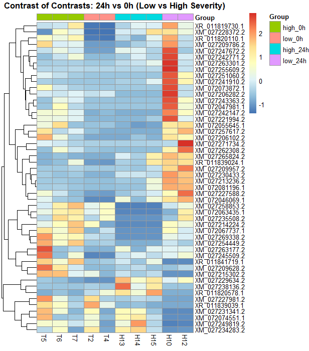

# Transcriptomics_Coffee-Rust_contrasts
This script was developed to perform a contrast-of-contrasts analysis using edgeR to evaluate transcriptional dynamics in coffee plants infected with rust (*Hemileia vastatrix*) with different levels of severity. Specifically, it compares the gene expression differences between high vs. low severity at 24 hours against those observed at 0 hours, to identify genes whose regulation is time-dependent and response-specific.

# Part I: Heatmap of differentially expressed genes from contrasts of contrasts between high vs. low severity at 24 hours vs 0 hours. 

## Function 
(low_24h - high_24h) - (low_0h - high_24 h)

The workflow includes the following key steps:
1. Preprocessing of raw counts: loading the count matrix, assigning groups, and filtering lowly expressed genes.
2. Normalization and dispersion estimation: adjusting library sizes and estimating dispersion parameters to ensure robust statistical modeling.
3. Contrast-of-contrasts testing: applying a generalized linear model (GLM) to compare expression differences across timepoints and treatments.
4. Differentially expressed genes (DEGs): extracting significant genes based on FDR thresholds and fold-change cutoffs.
5. Visualization with a heatmap: representing the standardized expression (z-scores) of the most significant genes, ordered by experimental groups for biological interpretation.

This approach aims to identifiy genes that are not only differentially expressed between treatments, but also dynamically regulated over time, to highlight molecular pathways potentially involved in stress responses and adaptation in *Coffea arabica*.

## Step 0: Initial configuration. 
```r
setwd("D:/lucianoboa/royatranscriptomics/analysis/practice")  # adjust path
library(edgeR)
library(pheatmap)
```

## Step 1. Load raw count matrix. 
```r
countData <- read.table("counts_matrix_transcript_id.txt", 
                        header = TRUE, row.names = 1, sep = "\t")
countData <- countData[, 6:21]  # select columns of interest

# Rename columns according to experimental design
colnames(countData) <- c("H10","H11","H12","H13","H14","H15","H16","H9",
                         "T1","T2","T3","T4","T5","T6","T7","T8")
```

## Step 2: Define experimental groups
```r
group <- rep(NA, ncol(countData))
names(group) <- colnames(countData)
group[c("H13","H14","H15")] <- "high_24h"
group[c("H10","H12")] <- "low_24h" 
group[c("T2","T4")] <- "low_0h" 
group[c("T5","T6","T7")] <- "high_0h"

# Keep only columns with defined groups
countData <- countData[, !is.na(group)]
group <- group[!is.na(group)]
group <- factor(group)
```

## Step 3: Create DGEList and normalization
```r
dge <- DGEList(counts = countData)
dge <- calcNormFactors(dge)
```

## Step 4: Filter lowly expressed genes
```r
keep <- rowSums(cpm(dge) > 1) >= 2  # CPM > 1 in at least 2 samples
dge <- dge[keep, , keep.lib.sizes=FALSE]
```

## Step 5: Design matrix and dispersion estimation
```r
design <- model.matrix(~0 + group)
colnames(design) <- levels(group)

dge <- estimateDisp(dge, design)
fit <- glmFit(dge, design)
```

## Step 6: Contrast of contrasts
```r
# (high_24h - low_24h) - (high_0h - low_0h)
lvl <- colnames(design)
contrast_vector <- numeric(length(lvl))
contrast_vector[which(lvl == "high_24h")] <- 1
contrast_vector[which(lvl == "low_24h")]  <- -1
contrast_vector[which(lvl == "high_0h")]  <- -1
contrast_vector[which(lvl == "low_0h")]   <- 1

lrt <- glmLRT(fit, contrast = contrast_vector)
```

## Step 7: Extract DEG table
```r
deTab <- topTags(lrt, n = Inf)$table

# Filter DEGs (adjust thresholds if very few genes pass)
deGenes <- rownames(deTab)[deTab$FDR < 0.2 & abs(deTab$logFC) > 0.5]
if(length(deGenes) < 2){
  topN <- min(10, nrow(deTab))
  deGenes <- rownames(deTab)[order(deTab$FDR)][1:topN]
}
```

## Step 8: Normalized CPM and z-score transformation
```r
cpm_norm <- cpm(dge, normalized.lib.sizes = TRUE)
cpm_de <- cpm_norm[deGenes, ]
zscore_matrix <- t(scale(t(cpm_de)))  # z-score per gene

top_genes <- rownames(deTab)[order(deTab$FDR)][1:50]  # top 50 by FDR
cpm_de <- cpm_norm[top_genes, ]
zscore_matrix <- t(scale(t(cpm_de)))
```

## Step 9: Column annotation (experimental groups)
```r
annotation_col <- data.frame(
  Group = group[colnames(zscore_matrix)]
)
rownames(annotation_col) <- colnames(zscore_matrix)
```

## Step 10: Heatmap visualization
```r
# Define the desired order of groups
group_order <- c("high_0h", "low_0h", "high_24h", "low_24h")

# Convert 'Group' into factor with specific order
annotation_col$Group <- factor(annotation_col$Group, levels = group_order)

# Reorder columns based on group factor
zscore_matrix <- zscore_matrix[, order(annotation_col$Group)]

# Plot heatmap
pheatmap(zscore_matrix,
         cluster_rows = TRUE,        # cluster genes
         cluster_cols = FALSE,       # keep defined column order
         show_rownames = TRUE,       # show gene IDs
         annotation_col = annotation_col,
         main = "Heatmap of Contrast-of-Contrasts",
         fontsize_col = 10)
```

